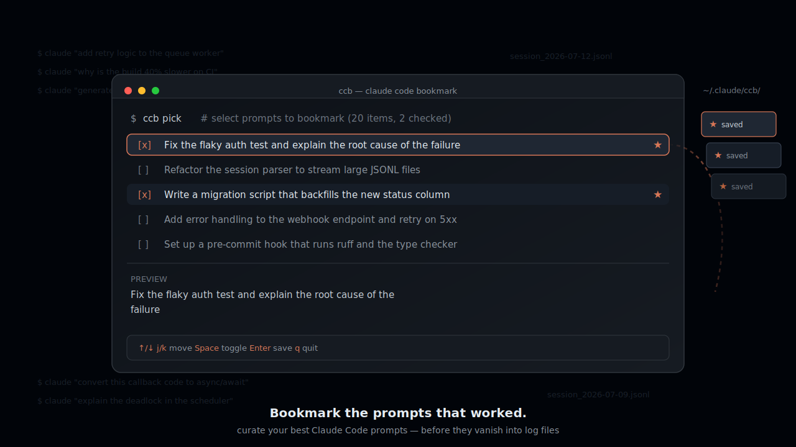

# ccb — Claude Code Bookmark

[English](README.md) | **日本語**

[](LICENSE)
[]()
[]()

「良かったプロンプト」をブックマークする CLI ツール。

`ccb` は [Claude Code](https://claude.com/claude-code) のセッション履歴を読み取り、いま居るプロジェクトで打ったプロンプトを一覧表示して、良かったものだけを保存できます。せっかく書いた名プロンプトがログの中に埋もれて消えていくのを防ぎます。

```
 ccb pick — select prompts to bookmark  (20 items, 2 checked)
 [x] 認証テストの不安定な失敗を修正して、根本原因を説明して
 [ ] セッションパーサーを大きなJSONLでもストリーム処理できるようにリファクタして
 [x] 新しいstatusカラムをバックフィルするマイグレーションスクリプトを書いて
 [ ] Webhookエンドポイントにエラーハンドリングを追加して5xxはリトライして
─────────────────────────────────────────────────────────────────────
 認証テストの不安定な失敗を修正して、根本原因を説明して

 ↑/↓/j/k: move  Space: toggle  Enter: save  q: quit
```

## 特徴

良いプロンプトは再利用できる資産です。しかしセッションが終わると、二度と開かない JSONL ファイルの中に埋もれてしまいます。`ccb` は Claude 起動中とは別のシェルセッションで動き、**実行中の Claude Code のコンテキストに一切影響を与えずに** 履歴を読み取り、ベストなプロンプトを検索可能なコレクションに変えます。

- **依存ゼロ** — Python 標準ライブラリのみの単一ファイル
- **読み取り専用で安全** — Claude Code のデータには何も書き込まず、履歴を読むだけ
- **プロジェクト単位** — 実行したディレクトリに対応する履歴・ブックマークだけを扱う
- **プレーンな JSONL 保存** — ブックマークは `~/.claude/ccb/` にあり、`grep` / `jq` / `fzf` でそのまま扱える
- **全角文字対応の TUI** — 日本語などの全角文字の表示幅を正しく計算して省略・折り返し

## インストール

### Homebrew

```sh
brew tap yuto1009/ccb
brew install ccb
```

### 手動インストール

```sh
git clone https://github.com/yuto1009/homebrew-ccb.git
ln -s "$(pwd)/homebrew-ccb/ccb" /usr/local/bin/ccb
```

Python 3.8 以上が必要です（macOS 標準の `python3` で動きます）。

## 使い方

Claude Code を使っているプロジェクトのディレクトリで実行します。

### `ccb pick` — 履歴からプロンプトを選んで保存

そのディレクトリの Claude Code 履歴から、重複除去済みの直近 20 件のユーザープロンプトを表示します。保存したいものにチェックを入れて Enter で確定します。

```sh
cd ~/your-project
ccb pick
```

### `ccb list` — ブックマークの一覧・削除

そのディレクトリのブックマークを新しい順に表示します。チェックした項目を Enter で確定すると、y/n 確認のうえ削除します。

```sh
ccb list
```

### キー操作

| キー | 動作 |
| --- | --- |
| `↑` `↓` / `k` `j` | カーソル移動 |
| `Space` | チェックの切り替え |
| `Enter` | 確定（pick: 保存 / list: 削除。削除時は y/n 確認あり） |
| `q` / `Esc` | 何もせず終了 |

画面下部には、カーソル位置のプロンプト全文のプレビューが常に表示されます。

## 仕組み

| 用途 | パス |
| --- | --- |
| 読み取り元（Claude Code 履歴） | `~/.claude/projects/<encoded-cwd>/*.jsonl` |
| 書き込み先（ブックマーク） | `~/.claude/ccb/<encoded-cwd>.jsonl` |

`<encoded-cwd>` は Claude Code 自身の命名規則（英数字以外を `-` に置換）に合わせているため、`ccb` は常に実行したディレクトリの履歴だけを対象にします。

ブックマークは 1 行 1 レコードの JSON です:

```json
{"text": "プロンプト本文", "bookmarked_at": "2026-07-16T12:00:00+09:00", "cwd": "/Users/you/your-project"}
```

抽出ルール:

- 実際のユーザープロンプトのみ — ツール実行結果、システムメタ、slash コマンド内部情報、割り込みマーカーは除外
- 同一テキストは 1 件に集約し、新しい順に表示
- ブックマーク済みのプロンプトは二重保存しない

## コントリビュート

Issue・Pull Request 歓迎です！

## ライセンス

[MIT](LICENSE)
